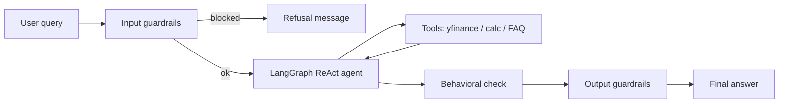

# Architecture

## Flow

## Components

| Layer | Role |
|--------|------|
| **Input guardrails** | Regex/heuristic detection of prompt-injection patterns, harmful requests, off-topic (non-finance) queries. |
| **Agent** | `langgraph.prebuilt.create_react_agent` with `ChatMistralAI` (Mistral API) and tool calling. **`recursion_limit`** (default 12, env `AGENT_RECURSION_LIMIT`) caps model/tool turns. **Retries with exponential backoff** on HTTP 429 (`LLM_INVOKE_RETRIES`, `LLM_RETRY_BASE_SEC`). System prompt asks for efficient tool use. |
| **Tools** | `get_stock_quote`, `get_price_history_summary` (yfinance), `calculate` (AST-safe arithmetic), `search_finance_faq` (keyword match on JSON). |
| **Behavioral guardrails** | Extra finance-only enforcement on combined query + draft answer. |
| **Output guardrails** | Softens “guaranteed return” style language, reduces personalized “you must buy” phrasing, appends a general disclaimer. |

## Guardrails (assignment mapping)

1. **Input**: Prompt injection + harmful / irrelevant (or off-domain) queries.  
2. **Output**: Mitigate misleading guarantees; append disclaimer; empty-response handling.  
3. **Behavioral**: Domain restriction to finance; refusal templates for clearly non-finance content.

## Data

- **Yahoo Finance** via `yfinance`: real-time-ish quotes and history; may fail or rate-limit—handle gracefully in demos.  
- **data/finance_faq.json**: small curated FAQ for retrieval-style answers.
